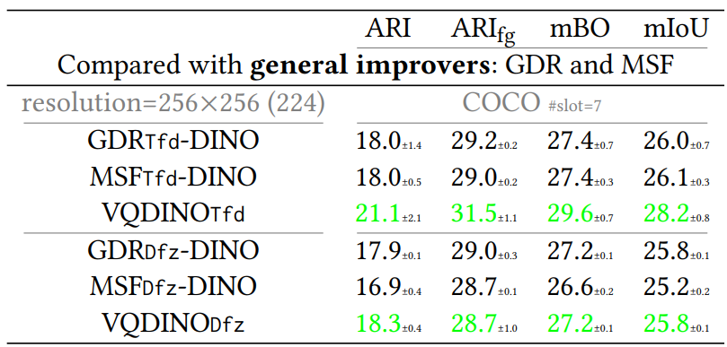

# `GDR` Grouped Discrete Representation for Object-Centric Learning


<br>
<br>

## ⚗️ (2026/01/06) Update !!!

Please check our brand new OCL works:
- **[RandSF.Q](https://github.com/Genera1Z/RandSF.Q)**: significantly surpasses existing video OCL state-of-the-art methods, e.g., **SlotContrast**, achieving **up to 10 points** improvement!
- **[SmoothSA](https://github.com/Genera1Z/SmoothSA)**: boosts the state of the art, e.g., **SPOT** / **DIAS** (images) and **SlotContrast** / **RandSF.Q** (videos), **even further** with **minimal modifications**!

<br>
<br>
<br>

---


## About

Official implementation of ECML 2025 paper "*Grouped Discrete Representation for Object-Centric Learning*" available on [arXiv:2411.02299](https://arxiv.org/abs/2411.02299).

**Please note that `GDR` is *re-implemented* upon codebase 🤗 [VQ-VFM-OCL](https://github.com/Genera1Z/VQ-VFM-OCL), different from the version described in the paper. For more details, models, checkpoints, datasets and results, please visit this repo.**

Quantitative results of object discovery on COCO:




## Converted Datasets 🚀

Dataset [COCO](https://cocodataset.org) is available on [dataset-coco](https://github.com/Genera1Z/VQ-VFM-OCL/releases/tag/dataset-coco), which is converted in LMDB database format and can be used off-the-shelf in this repo.


## Model Checkpoints 🌟

The checkpoints for the models are available.
- [slate-gdr-coco](https://github.com/Genera1Z/GroupedDiscreteRepresentation/releases/tag/slate-gdr-coco): SLATE-GDR, i.e., `GDR-Tfd`, on COCO.
- [slotdiffusion-gdr-coco](https://github.com/Genera1Z/GroupedDiscreteRepresentation/releases/tag/slotdiffusion-gdr-coco): SlotDiffusion-GDR, i.e., `GDR-Dfz`, on COCO.


## How to Use

Take SLATE-GDR on COCO as an example.

**(1) Environment**

To set up the environment, run:
```shell
# python 3.11
pip install -r requirements.txt
```

**(2) Dataset**

To prepare the dataset, download ***Converted Datasets*** and unzip to `path/to/your/dataset/`. Or convert them by yourself according to ```XxxDataset.convert_dataset()``` docs.

**(3) Train**

To train the model, run:
```shell
# 1. pretrain the GDR VAE module
python train.py \
    --seed 42 \
    --cfg_file config-slatesteve/vqvae-coco-c256-gdr.py \
    --data_dir path/to/your/dataset \
    --save_dir save

# *. place the best VAE checkpoint at archive-slatesteve/vqvae-coco-c256-gdr/best.pth
mv save archive-slatesteve

# 2. train the SLATE-GDR OCL model
python train.py \
    --seed 42 \
    --cfg_file config-slatesteve/slate_r_vqvae-coco-gdr.py \
    --data_dir path/to/your/dataset \
    --save_dir save \
    --ckpt_file archive-slatesteve/vqvae-coco-c256-gdr/best.pth
```

**(4) Evaluate**

To evaluate the model, run:
```shell
python eval.py \
    --cfg_file config-slatesteve/slate_r_vqvae-coco-gdr.py \
    --data_dir path/to/your/dataset \
    --ckpt_file archive-slatesteve/slate_r_vqvae-coco-gdr/best.pth \
    --is_viz True
# object discovery accuracy values will be printed in the terminal
# object discovery visualization will be saved to ./slate_r_vqvae-coco-gdr/
```

## Support

If you have any issues on this repo or cool ideas on OCL, please do not hesitate to contact me!
- page: https://genera1z.github.io
- email: rongzhen.zhao@aalto.fi, zhaorongzhenagi@gmail.com


## Citation

If you find this repo useful, please cite our work.
```
@article{zhao2025gdr,
  title={{Grouped Discrete Representation for Object-Centric Learning}},
  author={Zhao, Rongzhen and Wang, Vivienne and Kannala, Juho and Pajarinen, Joni},
  journal={ECML PKDD},
  year={2025}
}
```
